# Theme Usage / How-to Quetions

## Edit Header & Footer visually

Theme provide a great feature let you edit headers & footers packed with the theme as well as customize and add your own headers and footers.

From your admin page, click **HTML Blocks** on the left sidebar, then click to any entry to edit it.

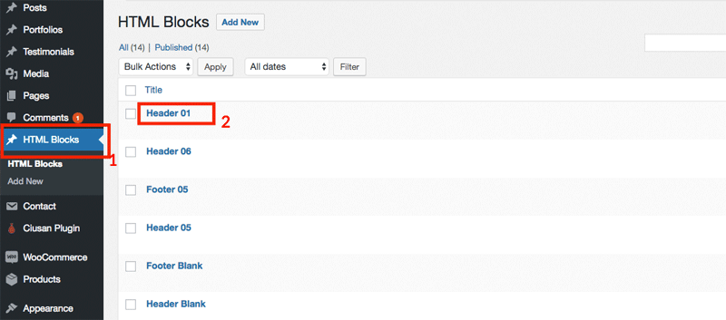

Now you can edit it as you wish with **Visual Composer**:

	<ul class="fa-ul">
		<li>
			<i class="fa fa-info-circle fa-lg fa-li" aria-hidden="true"></i>
			Note: If you don't see it, make sure you install and activate the plugin <strong>WPDance HTMLBlocks</strong> supplied with the theme.
		</li>
	</ul>

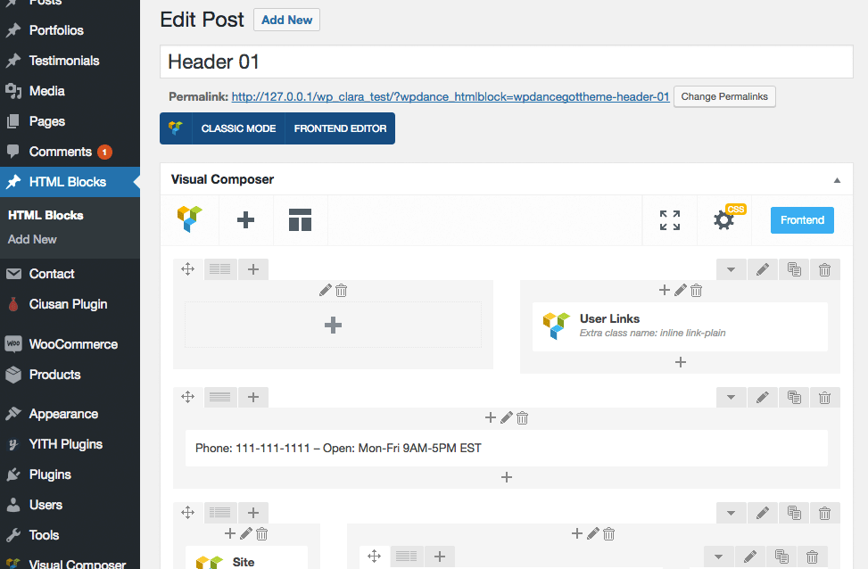

## Page Builder with Visual Composer

You can edit a page using **Visual Composer** with both **Backend Editor** and **Frontend Editor** mode.

To edit page with Frontend Editor, login to your admin account, then view the page on front-end, click button **Edit with Visual Composer**:

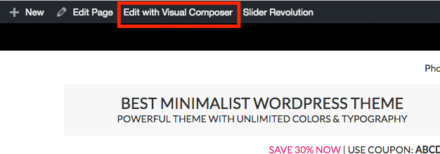

You can freely edit any block contents, move blocks or add new blocks:

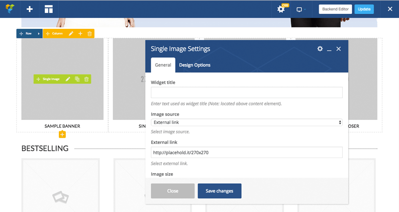

If you refer to edit page in the backend, click button **Backend Editor** to swith standard editor to Visual Composer editor.

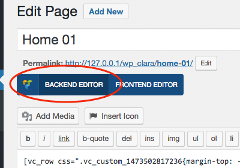

Now you can edit the page with drag & drop features of Visual Composer:

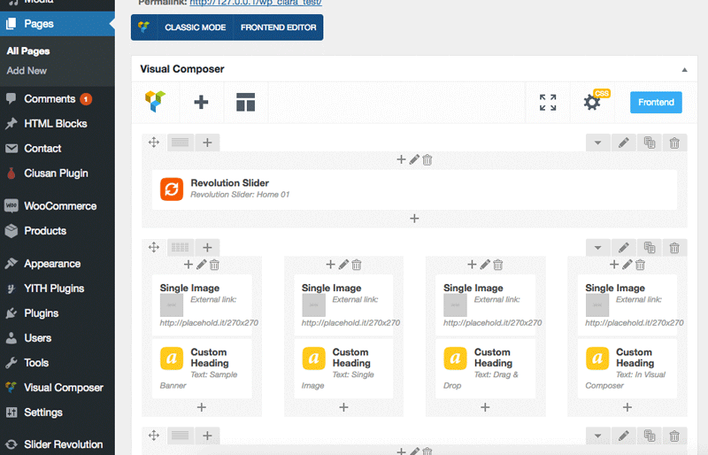

## Specific layout for a page, post, product, portfolio...

Theme adds extra options for any Page, Post, Product and Portfolio items, let you customize layout of every single page:

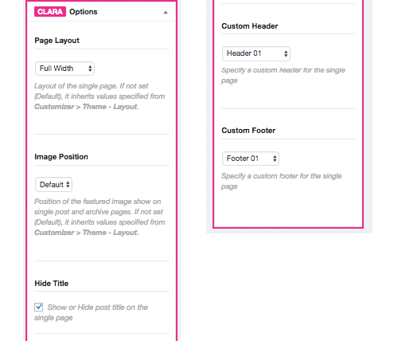

- **Page Layout**: Let you configure layout (full width, left sidebar, right sidebar...) when viewing the single item page.
- **Image Position**: Useful for post. Let you choose position to display featured image (left, right, top).
- **Hide Title**: Show or Hide page title when viewing the single item page.
- **Custom Header**: Let you assign a different header when viewing the single item page.
- **Custom Footer**: Let you assign a different footer when viewing the single item page.

## Specific layout for a category, tag, taxonomy, product category...

Theme adds extra options for **Category**, **Taxonomy**, **WooCommerce taxonomy**, **Portfolio taxonomy** and other post type taxonomy, let you customize specific layout for each archive page.

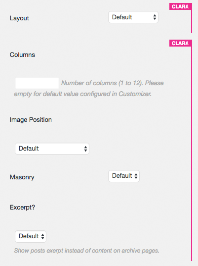

- **Columns**: Number of items per row.
- **Layout**: Let you configure layout (full width, left sidebar, right sidebar...) when viewing the single item page.
- **Image Position**: Useful for post. Let you choose position to display featured image (left, right, top).
- **Masonry**: Display items with masonry layout.
- **Excerpt**: Show excerpt instead of content?

## Make different sidebar for a specific page

	<ul class="fa-ul">
		<li>
			<i class="fa fa-info-circle fa-lg fa-li" aria-hidden="true"></i>
			<strong>Note:</strong> Make sure plugin WooSidebars is installed and activated.
		</li>
	</ul>

This feature requires plugin WooSidebars, so make sure you have it installed and activated properly.

From admin page, go to **Appearance** > **Widget Areas**, click button **Add New**.

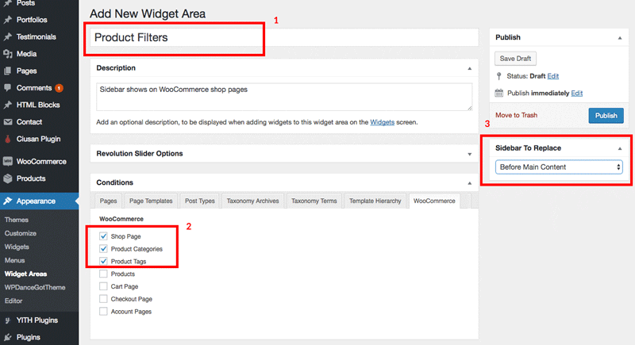

1. Enter the name of new sidebar, anything you want.
2. Select pages where the sidebar should appear.
3. Choose the original sidebar which will be replace by this new sidebar.
4. Finally, click **Publish** button.

In this example we will create a new sidebar show at the top of Shop Page, Product Categories, Product Tags. The sidebar will contain product filters widgets.

Now, let's see the new sidebar were created. Go to **Appearance** > **Widgets**, you will see the new sidebar exactly what you have created:

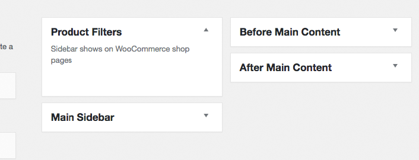

## Show horizonal product fitlers on top of shop page

Assume you already created the new sidebar "Product Filters" which will show up on WooCommerce pages only. This section, we will guide to show widgets like this:

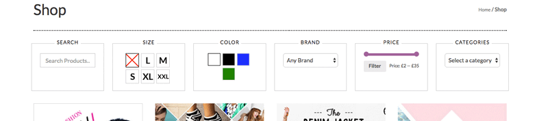

Let go to **Appearance** > **Widgets**. Add these widgets below to sidebar **Product Filters**:

**Text Widget:**

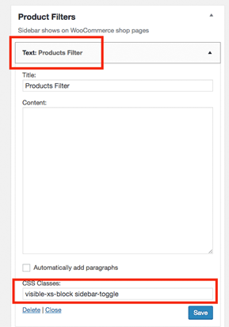

This widget contents only show reponsive mobile screen.

- **Title**: `Products Filter` or anything you want.
- **CSS Classes:**: `visible-xs-block sidebar-toggle`. The class `visible-xs-block` makes the wigets only show on mobile size screen (See [Bootstrap responsive utilities](http://getbootstrap.com/css/#responsive-utilities) for reference). `sidebar-toggle` make site knowing that when click on this element, contains inside the sidebar expandable/collapsable. 

	<ul class="fa-ul">
		<li>
			<i class="fa fa-info-circle fa-lg fa-li" aria-hidden="true"></i>
			<strong>Note:</strong> <strong>CSS Classes</strong> field only appear if plugin <strong>Widget CSS Classes</strong> is installed and activated.
		</li>
	</ul>

**WooCommerce Product Search Widget:**

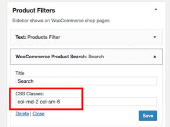

- **Title**: `Search` or anything you want.
- **CSS Classes:**: `col-md-2 col-sm-6`. This is Bootstrap CSS classes that allows the widget take 2 columns space on desktop screen, and 6 columns on small screen in total of 12 columns per row. In other words, The sidebar will spread 6 widgets per row on desktop screen and 2 widgets per row on small screen. See more [Bootstrap Grid System](http://getbootstrap.com/css/#grid) for reference.

**WooCommerce Layered Nav** for product **Size** attribute:

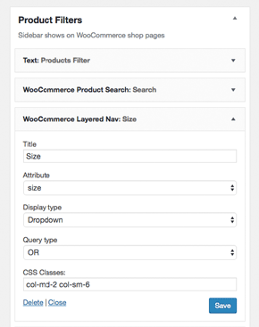

**WooCommerce Layered Nav** for product **Color** attribute:

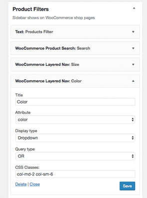

**WooCommerce Layered Nav** for product **Brand** attribute:

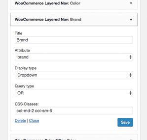

**WooCommerce Price Filter**:

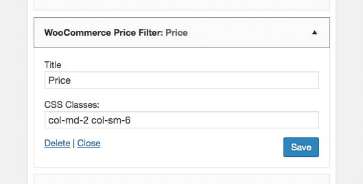

**WooCommerce Product Categories**:

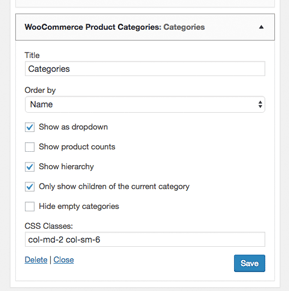

Let see the your WooCommerce shop page:

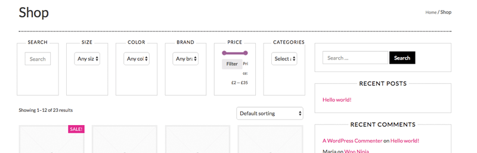

Don't worry if it doesn't look like the demo.

Next step, let's make this page show full widget so that no right sidebar appears. Go to **Pages**, edit page named **Shop** which WooCommerce automatically created when activated the plugin:

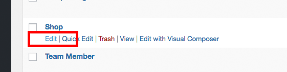

On the right sidebar, **Clara Options**, choose **Page Layout** is `Full Width` and save the page:

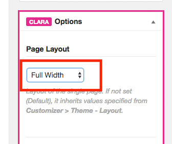

## Configure colors & image swatches for WooCommerce product attributes

Next step, we will configure **Color** and **Size** attributes to enable color swatches and image swatches features. Go to **Appearance** > **Customize** to open Theme Customizer:

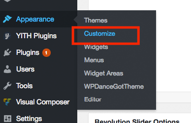

Click **Layout** > **WooCommerce** > enter `Color` to **Color Attributes** and `Size` to **Image Attributes** boxes, then click **Save & Publish** button.

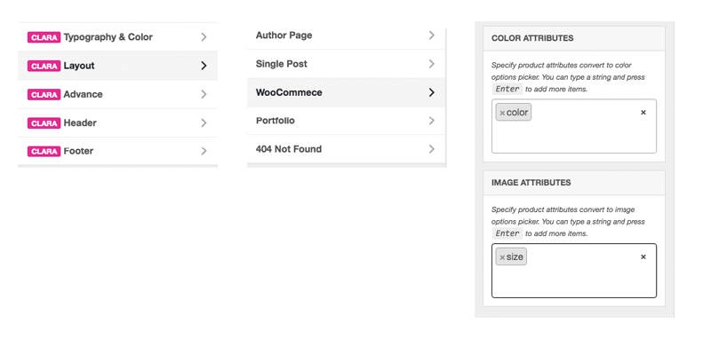

Now go to **Products** > **Attributes** to check your existing product attributes:

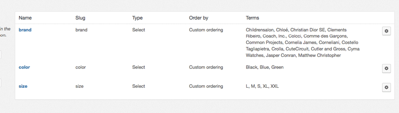

You will see these attributes if you import sample data `products.xml`.

- **Color** attribute has value `Black`, `Blue`, `Green`. it values will transform to color name when showing on the widget.
- **Size** attribute has value `L`, `M`, `S`, `XL`, `XXL`. Theme will look for presentative images in directory `wp-content/themes/wpdanceclaratheme/images/product_attributes/pa_[attribute name]/[attribute value].png` you can put your own images in this folder or **Child Theme** folder as well.

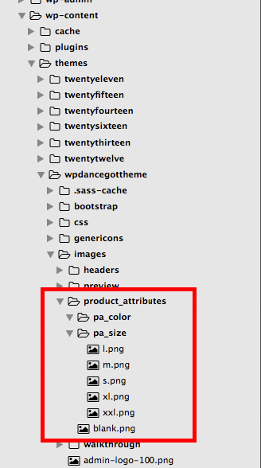

Now check your Shop page again:

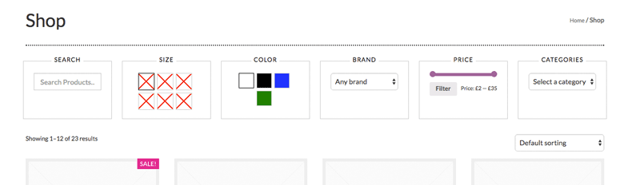

It shows just like the demo! 

You can test on responsive mode tablet and mobile as well:

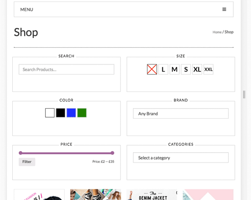

On mobile screen:

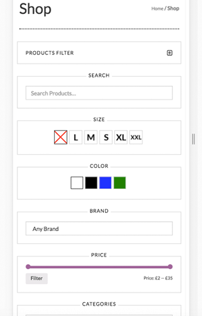

## Configure default layouts in Customizer

Go to **Appearance** > Customize. In Customizer, click **Layout**, here you can configure default layouts for any page types:

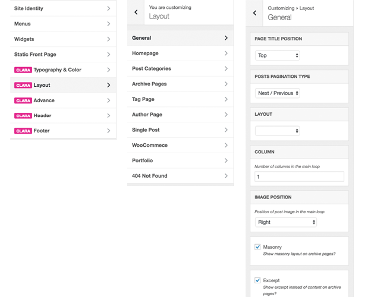

- **General**: Common settings for default and general pages.
- **Homepage**: For Home page (Front page).
- **Post Categories**: For Post Category archive pages.
- **Archive Pages**: For other archive pages.
- **Tag Page**: For Tag archive page.
- **Author Page**: For Author archive page.
- **Single Post**: For single post content page.
- **WooCommerce**: For WooCommerce pages.
- **Portfolio**: For Portfolio pages belong to Portfolio plugin.
- **404 Not Found**: For 404 Not Found page.

Layout options for each section include:

- **Page Title Position**: Show Page Title at top position (below the navigation) or standard wordpress position.
- **Posts Pagination Type**: Show post pagination bar as numbers or next/back buttons.
- **Layout**: Full width, Left sidebar or Right sidebar.
- **Column**: Default number of items per row.
- **Image Position**: Show featured images position above post title, right of post or left of post, or both.
- **Masonry**: Apply masonry layout effect.
- **Excerpt**: Show full content or excerpt only on posts loop.
- **Products Per Page**: Number of products per page for WooCommerce shop.
- **Products Column**: Number of products per row for WooCommerce shop.
- **Color Attributes**: Specify which product attributes showing as color swatches.
- **Image Attributes**: Specify which product attributes showing as image swatches.
- **Portfolio Items Per Page**: Number of portfolio items showing per page.
- **Static Page 404 Not Found**: Specify which static page showing for 404 Not Found page.

## Customize Typography and Colors

In WordPress Customizer, click on **Typography & Color**:

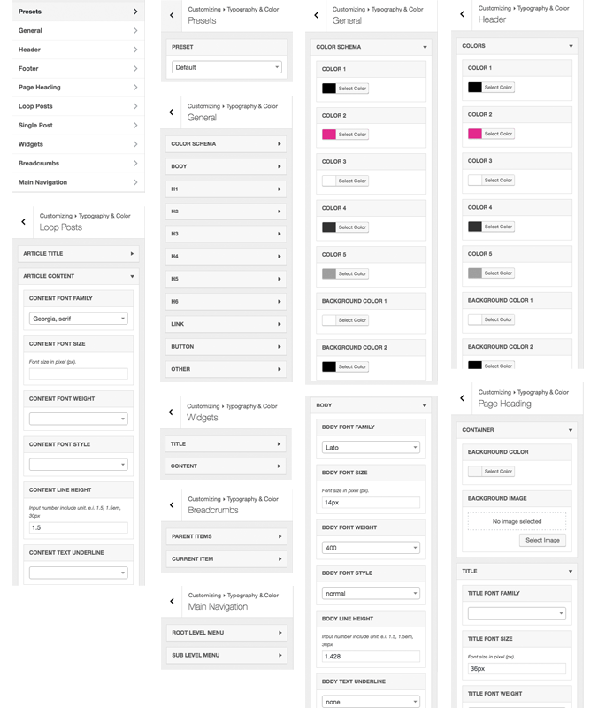

- **Presets**: Choose Typography & Color presets builtin by the theme.
- **General**:
	+ **Color Schema**: Configure general color schema like colors, background colors, border colors.
	+ **Body**: Typography, font, size, color for default text.
	+ **H1** to H6: Configure typography and colors for these elements.
	+ **Link**: Configure typography and colors for links.
	+ **Button**: Configure typography and colors for buttons.
	+ **Button**: Configure typography and colors for buttons.
	+ **Others**.
- **Header** / **Footer**:
	+ **Colors**: Configure color schema for header / footer section.
- **Page Heading**:
	+ **Container**: Configure background image, color of page heading container.
	+ **Title**: Configure typography and colors of page heading title.
	+ **Content**: Configure typography and colors of content inside page heading, like description.
- **Loop Posts**: Configure typography and color for:
	+ **Article Title**
	+ **Article Content**
	+ **Article Meta**
- **Single Post**: Configure typography and color on single post page for:
	+ **Article Title**
	+ **Article Content**
	+ **Article Meta**
- **Widgets**: Configure typography and color for widgets.
	+ **Title**
	+ **Content**
- **Breadcrumbs**: Configure typography and color for breadcrumb bar.
	+ **Parent Items**
	+ **Current Item**
- **Main Navigation**: Configure typography and color for menus.
	+ **Root Level Menu**
	+ **Sub Level Menu**
	

## Increase page loading speed with plugin WP-Super-Cache

## Make mega menu with plugin Ubermenu

## Explore theme's custom shortcodes for Visual Composer

## Helpful CSS classes

## Coding your own customization in Child Theme (Hack the theme)