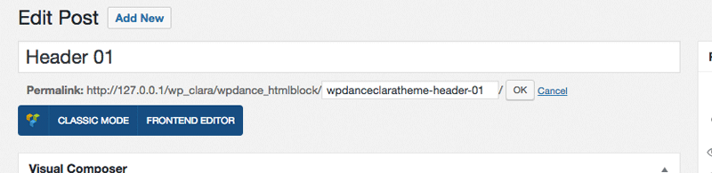
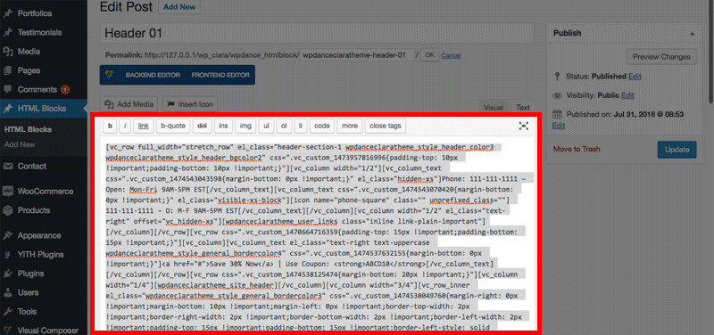
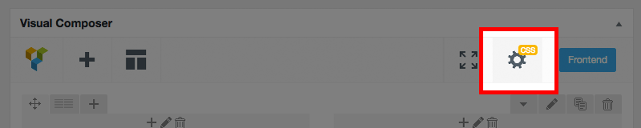
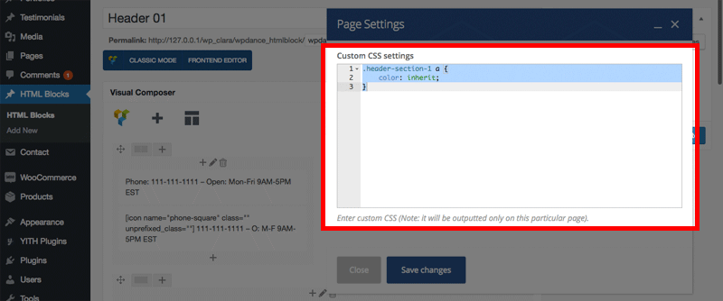

# Manage Headers & Footers with WPDance HTMLBLock plugin

Theme uses plugin **WPDance HTMLBlock** for managing, adding and editing unlimited Headers and Footers using Visual Composer drag & drop content builder.

To install and activate the plugin **WPDance HTMLBlocks**, please follow the [instruction](quickstart.md#install-plugins) from Quick Start section.

When the theme is activated, default Headers & Footers provided by the theme will be automatically added.

	<ul class="fa-ul">
		<li>
			<i class="fa fa-info-circle fa-lg fa-li" aria-hidden="true"></i>
			If you accidentially delete or want to restore the original version, just delete it, then deactivate and reactivate the theme again, it will be restored automatically.
		</li>
	</ul>

If you refer to add add or edit each Header and Footer manually, you can do as following steps.

## Create Header 01

On the admin page, click menu **HTML Blocks** > **Add New** to add a new header or footer.

- **Title**: Enter title, example: `Header 01`.
- **Slug**: 
	- For Header, the slug name must contains a word `header`, example: `wpdanceclaratheme-header-01`
	- For Footer, the slug name must contains a word `footer`.

Click **Classic Mode** button and click tab **Text** to switch to WordPress standard text editor. 

For Copy content of file [sample-data/header-01.txt](https://raw.githubusercontent.com/tvlgiao/wpdance-clara-docs/master/sample-data/header-01.txt) into the **content** field:

Click button **Backend Editor** to go back Visual Composer editor mode.

Next, click button **Page Settings** to open CSS editor for this header/footer:

Copy content of file [sample-data/header-01-css.txt](https://raw.githubusercontent.com/tvlgiao/wpdance-clara-docs/master/sample-data/header-01-css.txt) into the **Custom CSS settings** field:

Click **Save changes**.

Finally, click **Publish & Update** button to save the header/footer.

## Create Header 02

Doing simliar Home 01 with below data:

- **Title**: `Header 02`
- **Slug**: `wpdanceclaratheme-header-02`
- **Content**: Copy from content of file [sample-data/header-02.txt](https://raw.githubusercontent.com/tvlgiao/wpdance-clara-docs/master/sample-data/header-02.txt)
- **Custom CSS settings**: Copy from content of file [sample-data/header-02-css.txt](https://raw.githubusercontent.com/tvlgiao/wpdance-clara-docs/master/sample-data/header-02-css.txt)

## Create Header 03

Doing simliar Home 01 with below data:

- **Title**: `Header 03`
- **Slug**: `wpdanceclaratheme-header-03`
- **Content**: Copy from content of file [sample-data/header-03.txt](https://raw.githubusercontent.com/tvlgiao/wpdance-clara-docs/master/sample-data/header-03.txt)
- **Custom CSS settings**: Copy from content of file [sample-data/header-03-css.txt](https://raw.githubusercontent.com/tvlgiao/wpdance-clara-docs/master/sample-data/header-03-css.txt)

## Create Header 05

Doing simliar Home 01 with below data:

- **Title**: `Header 05`
- **Slug**: `wpdanceclaratheme-header-05`
- **Content**: Copy from content of file [sample-data/header-05.txt](https://raw.githubusercontent.com/tvlgiao/wpdance-clara-docs/master/sample-data/header-05.txt)
- **Custom CSS settings**: Copy from content of file [sample-data/header-05-css.txt](https://raw.githubusercontent.com/tvlgiao/wpdance-clara-docs/master/sample-data/header-05-css.txt)

## Create Header 06

Doing simliar Home 01 with below data:

- **Title**: `Header 06`
- **Slug**: `wpdanceclaratheme-header-06`
- **Content**: Copy from content of file [sample-data/header-06.txt](https://raw.githubusercontent.com/tvlgiao/wpdance-clara-docs/master/sample-data/header-06.txt)
- **Custom CSS settings**: Copy from content of file [sample-data/header-06-css.txt](https://raw.githubusercontent.com/tvlgiao/wpdance-clara-docs/master/sample-data/header-06-css.txt)

## Create Footer 01

Doing simliar Home 01 with below data:

- **Title**: `Footer 01`
- **Slug**: `wpdanceclaratheme-footer-01`
- **Content**: Copy from content of file [sample-data/footer-01.txt](https://raw.githubusercontent.com/tvlgiao/wpdance-clara-docs/master/sample-data/footer-01.txt)
- **Custom CSS settings**: Copy from content of file [sample-data/footer-01-css.txt](https://raw.githubusercontent.com/tvlgiao/wpdance-clara-docs/master/sample-data/footer-01-css.txt)

## Create Footer 02

Doing simliar Home 01 with below data:

- **Title**: `Footer 02`
- **Slug**: `wpdanceclaratheme-footer-02`
- **Content**: Copy from content of file [sample-data/footer-02.txt](https://raw.githubusercontent.com/tvlgiao/wpdance-clara-docs/master/sample-data/footer-02.txt)
- **Custom CSS settings**: Copy from content of file [sample-data/footer-02-css.txt](https://raw.githubusercontent.com/tvlgiao/wpdance-clara-docs/master/sample-data/footer-02-css.txt)

## Create Footer 03

Doing simliar Home 01 with below data:

- **Title**: `Footer 03`
- **Slug**: `wpdanceclaratheme-footer-03`
- **Content**: Copy from content of file [sample-data/footer-03.txt](https://raw.githubusercontent.com/tvlgiao/wpdance-clara-docs/master/sample-data/footer-03.txt)
- **Custom CSS settings**: Copy from content of file [sample-data/footer-03-css.txt](https://raw.githubusercontent.com/tvlgiao/wpdance-clara-docs/master/sample-data/footer-03-css.txt)

## Create Footer 04

Doing simliar Home 01 with below data:

- **Title**: `Footer 04`
- **Slug**: `wpdanceclaratheme-footer-04`
- **Content**: Copy from content of file [sample-data/footer-04.txt](https://raw.githubusercontent.com/tvlgiao/wpdance-clara-docs/master/sample-data/footer-04.txt)
- **Custom CSS settings**: Copy from content of file [sample-data/footer-04-css.txt](https://raw.githubusercontent.com/tvlgiao/wpdance-clara-docs/master/sample-data/footer-04-css.txt)

## Create Footer 05

Doing simliar Home 01 with below data:

- **Title**: `Footer 05`
- **Slug**: `wpdanceclaratheme-footer-05`
- **Content**: Copy from content of file [sample-data/footer-05.txt](https://raw.githubusercontent.com/tvlgiao/wpdance-clara-docs/master/sample-data/footer-05.txt)
- **Custom CSS settings**: Copy from content of file [sample-data/footer-05-css.txt](https://raw.githubusercontent.com/tvlgiao/wpdance-clara-docs/master/sample-data/footer-05-css.txt)

## Create Footer 06

Doing simliar Home 01 with below data:

- **Title**: `Footer 06`
- **Slug**: `wpdanceclaratheme-footer-06`
- **Content**: Copy from content of file [sample-data/footer-06.txt](https://raw.githubusercontent.com/tvlgiao/wpdance-clara-docs/master/sample-data/footer-06.txt)
- **Custom CSS settings**: Copy from content of file [sample-data/footer-06-css.txt](https://raw.githubusercontent.com/tvlgiao/wpdance-clara-docs/master/sample-data/footer-06-css.txt)

## Configure Default Header & Footer

To set a default header and footer for your site, go to admin page, click menu **Appearance** > **Customize** to open WordPress Customizer panel.

Click **CLARA Header**, choose a header you want. go back and click **CLARA Footer**, choose a footer you want. Finally, click **Save & Publish** button.

## Use different Header or Footer for a page

If you want a page has different header or footer, you can specify which header and footer in CLARA Options when editing page or post. Please read more instruction [Specific layout for a page, post, product, portfolio](howto.md#specific-layout-for-a-page-post-product-portfolio) in How-To section.

