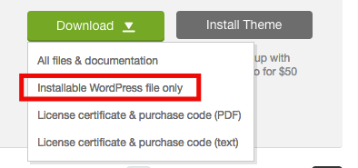
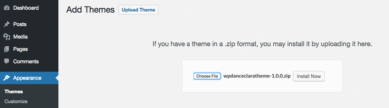
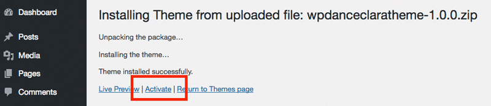
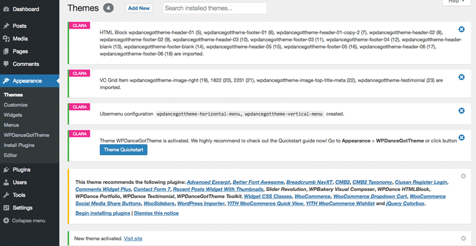

# Theme Installation

## Video Installing Theme Step By Step

<iframe width="640" height="360" src="https://www.youtube.com/embed/W2sb7WRE8hI" frameborder="0" allowfullscreen></iframe>

## Installation

Go to <https://themeforest.net/downloads> and download the theme **Installable WordPress file only**:

Login to your WordPress admin, go to **Appearance** > **Themes**, click button **Add New**. Then click button **Upload Theme**, choose the zip file and click button Install Now start uploading the theme:

Click **Activate** to activate the theme:

If you see below messages, it means the theme is installed and activated successfully:

Click the button **Theme Quickstart** appear above to open the **Quick Start** page.