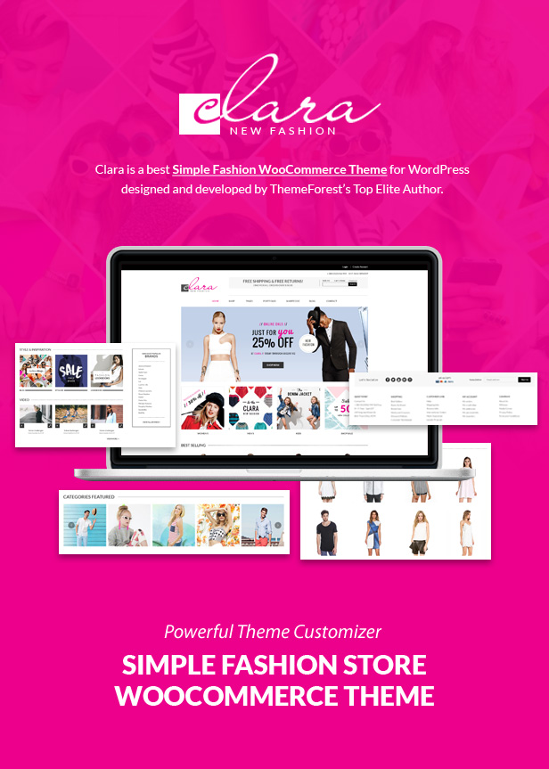
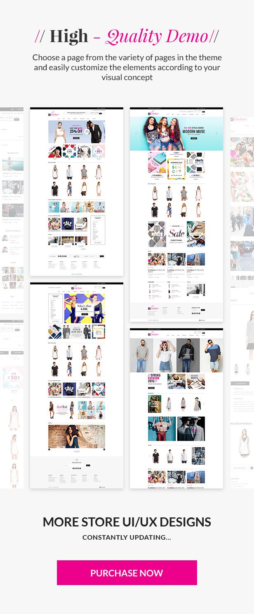
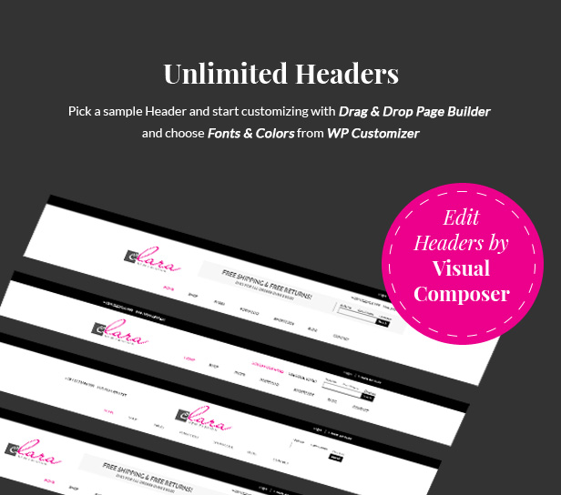
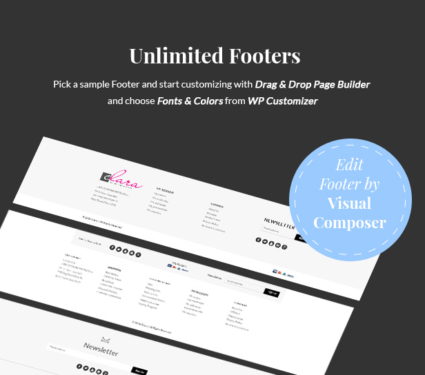
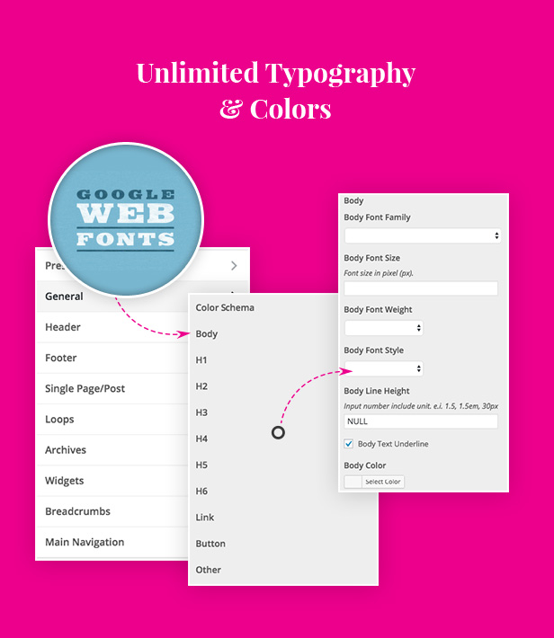
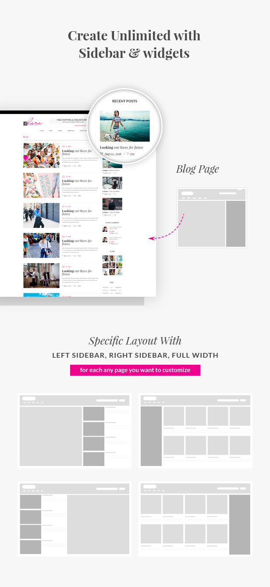
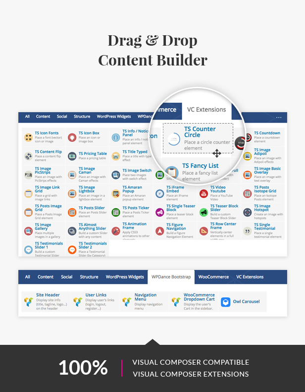
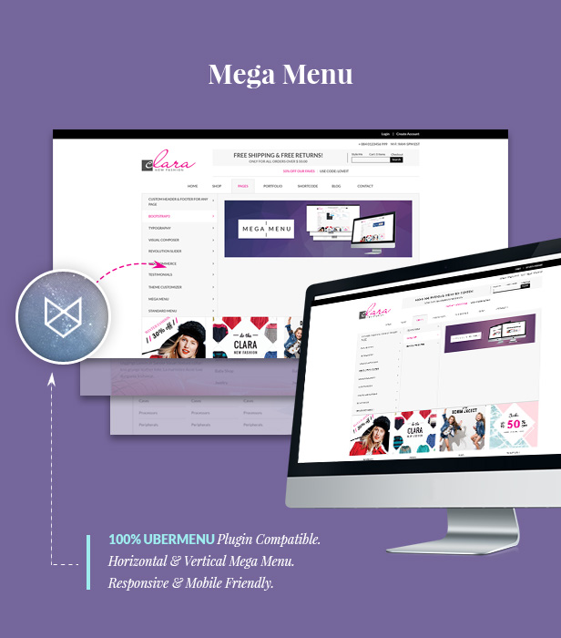
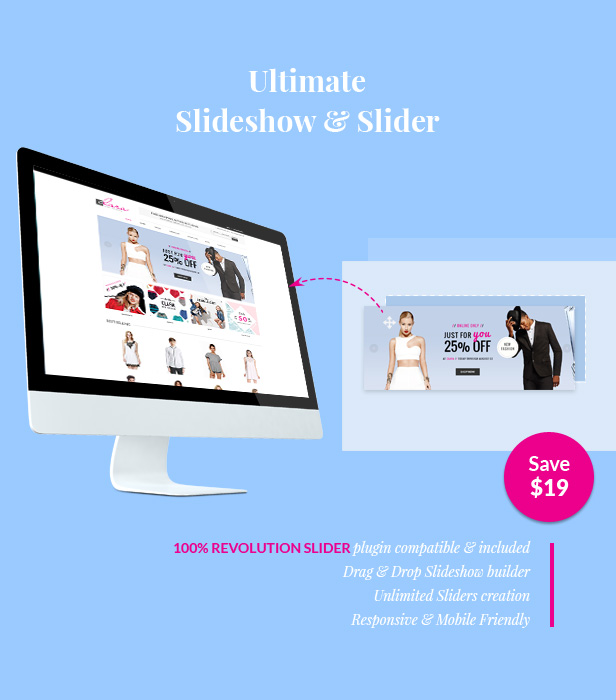
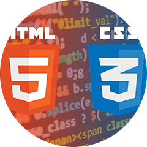

# Theme Introduction

**WP Clara** is a best **Simple Fashion WooCommerce Theme** with **Advanced Theme Customizer**, clean and minimal design style perfectly suitable for opening ecommerce store with low budget and time saving.

Theme includes: **Visual Composer** content builder plugin; **Revolution Slider** plugin; **WooCommerce**; **Wishlist**; **Quick-View**; Product attribute **Color Swatches**, **Image Swatches**; **Portfolio** plugin; drag & drop **Header & Footer** builder; unlimited **Typography & Colors** editor via WP Customizer; unlimited Sidebars, Layouts for any pages; 100% **UberMenu** pre-made styles ready; built with 100% **Bootstrap 3** CSS Framework; all **PSD** design files included; [online user guide](https://tvlgiao.github.io/wpdance-clara-docs/); and many other plugins included for FREE...

<table markdown="1" width="100%">
<tr markdown="1">
<td width="50%">

</td>
<td width="50%">
### Multi-Lingual and Multiple Languages

* 100% WPML plugin compatible.
* Theme translation support.
</td>
</tr>

<tr markdown="1">
<td>

</td>
<td>
### Built With Advanced Technology

* SASS
* Bootstrap 3 CSS Framework
* HTML5 &amp; CSS3
* FontAwesome
* Custom Font Icons
* Child Theme support for your custom development
* Strictly following WordPress code standard &amp; code comments clearly.
</td>
</tr>

<tr markdown="1">
<td>

</td>
<td>
### Easy Installation, Configuration &amp; Customization

* Friendly developed for WP users - Standard WP theme installation, NO need reading guide for experience WP users.
* Configuration &amp; Customization are straightforward via WP Customizer panels.
* Custom development via Child Theme.
</td>
</tr>

<tr markdown="1">
<td>

</td>
<td>
### Help and Support
* Support via Ticket System, Comments &amp; Author Private Message.
* Online Documentation, Guide, Troubleshooting.
* Subscribe Youtube Video Channel for Guide &amp; Tips.
</td>
</tr>
</table>

## Key Features:

* **Visual Composer** plugin for beautiful content builder - NO CODING REQUIRED.
* **Revolution Slider** plugin for unlimited slideshows drag & drop builder.
* 100% **WooCommerce** plugin support, with extra features: **Wishlist**, **Quick-view**, product attribute **Color Swatches**, **Image Swatches**.
* Flexible **Portfolio** plugin created special for our theme.
* Unlimited **Headers & Footers** - Drag & Drop header, footer builder.
* Unlimited **Typography & Colors** customization via WP Customizer for every elements.
* Unlimited sidebars, layouts for any specific pages.
* 100% UberMenu (Mega Menu) support with pre-made styles.
* Built with 100% **Bootstrap 3** CSS Framework.
* All layout design Photoshop **PSD files**.
* Detailed and online documentation.
* Responsive web design, mobile friendly.
* Various **Blog** layouts 2-8 columns; Featured images on left, right or full width; Masonry layouts.
* Sample pages for testimonials, team member, price table, faqs, contact us, about us, 404 not found, coming soon, teaser...
* And MANY other plugins included...

 

 

 
