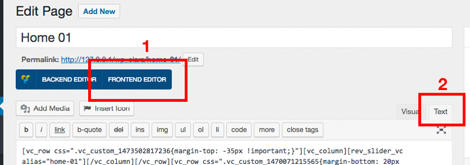

# Setup Pages

This instruction will help you create all pages like our demo site.

Login to your admin backend, click **Pages** > **Add New**. 

Click **Frontend Editor**, click tab **Text** to edit page in text mode so that you can copy sample content we provide.

Follow below instruction to create page you want.

## Home 01

## Home 02

## Home 03

## Home 04

## Home 05

## Home 06

## Coming Soon / Teaser

## 404 Not Found

## About Us

## Contact Us

## FAQs

## Testimonials

## Price Table

## Team Member

