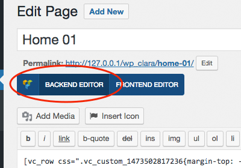

# Setup Sample Static Pages

This instruction will help you create all pages like our demo site.

	<ul class="fa-ul">
		<li>
			<i class="fa fa-info-circle fa-lg fa-li" aria-hidden="true"></i>
			<strong>Note:</strong> You should activate all recommended plugins in order to get pages work properly like our demo site.
		</li>
	</ul>

Login to your admin backend, click **Pages** > **Add New**. Follow below instruction to create page you want.

## Home 01

Click **Classic Mode**, click tab **Text** to edit page in text mode so that you can copy sample content we provide:

Copy content of file [sample-data/page-home01.txt](https://raw.githubusercontent.com/tvlgiao/wpdance-clara-docs/master/sample-data/page-home01.txt) into the **content** field:

Click button **Backend Editor** to go back Visual Composer editor mode:

Click CSS button below to add custom CSS for this page:

Copy content of file [sample-data/page-home01-css.txt](https://raw.githubusercontent.com/tvlgiao/wpdance-clara-docs/master/sample-data/page-home01-css.txt) into the **Page Settings** box and click **Save changes** button:

On the right column, configure page option **CLARA Options** like below:

- **Page Layout**: `Full Width`
- **Image Position**: `Default`
- **Hide Title**: `Yes`
- **Custom Header**: `Header 01`
- **Custom Footer**: `Footer 01`

Click **Publish** (or **Update**) button to finish.

## Home 02

Do similiar **Home 01** but with contents:

- **Content**: [sample-data/page-home02.txt](https://raw.githubusercontent.com/tvlgiao/wpdance-clara-docs/master/sample-data/page-home02.txt)
- **CSS Code**: Leave empty
- **CLARA Options**:
	- **Page Layout**: `Full Width`
	- **Image Position**: `Default`
	- **Hide Title**: `Yes`
	- **Custom Header**: `Header 02`
	- **Custom Footer**: `Footer 02`

## Home 03

Do similiar **Home 01** but with contents:

- **Content**: [sample-data/page-home03.txt](https://raw.githubusercontent.com/tvlgiao/wpdance-clara-docs/master/sample-data/page-home03.txt)
- **CSS Code**: [sample-data/page-home03-css.txt](https://raw.githubusercontent.com/tvlgiao/wpdance-clara-docs/master/sample-data/page-home03-css.txt)
- **CLARA Options**:
	- **Page Layout**: `Full Width`
	- **Image Position**: `Default`
	- **Hide Title**: `Yes`
	- **Custom Header**: `Header 03`
	- **Custom Footer**: `Footer 03`

## Home 04

Do similiar **Home 01** but with contents:

- **Content**: [sample-data/page-home04.txt](https://raw.githubusercontent.com/tvlgiao/wpdance-clara-docs/master/sample-data/page-home04.txt)
- **CSS Code**: [sample-data/page-home04-css.txt](https://raw.githubusercontent.com/tvlgiao/wpdance-clara-docs/master/sample-data/page-home04-css.txt)
- **CLARA Options**:
	- **Page Layout**: `Full Width`
	- **Image Position**: `Default`
	- **Hide Title**: `Yes`
	- **Custom Header**: `Header 02`
	- **Custom Footer**: `Footer 04`

## Home 05

Do similiar **Home 01** but with contents:

- **Content**: [sample-data/page-home05.txt](https://raw.githubusercontent.com/tvlgiao/wpdance-clara-docs/master/sample-data/page-home05.txt)
- **CSS Code**: Leave empty
- **CLARA Options**:
	- **Page Layout**: `Full Width`
	- **Image Position**: `Default`
	- **Hide Title**: `Yes`
	- **Custom Header**: `Header 05`
	- **Custom Footer**: `Footer 05`

## Home 06

Do similiar **Home 01** but with contents:

- **Content**: [sample-data/page-home06.txt](https://raw.githubusercontent.com/tvlgiao/wpdance-clara-docs/master/sample-data/page-home06.txt)
- **CSS Code**: Leave empty
- **CLARA Options**:
	- **Page Layout**: `Full Width`
	- **Image Position**: `Default`
	- **Hide Title**: `Yes`
	- **Custom Header**: `Header 06`
	- **Custom Footer**: `Footer 06`

## Home 07

Do similiar **Home 01** but with contents:

- **Content**: [sample-data/page-home07.txt](https://raw.githubusercontent.com/tvlgiao/wpdance-clara-docs/master/sample-data/page-home07.txt)
- **CSS Code**: Leave empty
- **CLARA Options**:
	- **Page Layout**: `Full Width`
	- **Image Position**: `Default`
	- **Hide Title**: `Yes`
	- **Custom Header**: `Header 07`
	- **Custom Footer**: `Footer 07`

## Home 08

Do similiar **Home 01** but with contents:

- **Content**: [sample-data/page-home08.txt](https://raw.githubusercontent.com/tvlgiao/wpdance-clara-docs/master/sample-data/page-home08.txt)
- **CSS Code**: [sample-data/page-home08-css.txt](https://raw.githubusercontent.com/tvlgiao/wpdance-clara-docs/master/sample-data/page-home08-css.txt)
- **CLARA Options**:
	- **Page Layout**: `Full Width`
	- **Image Position**: `Default`
	- **Hide Title**: `Yes`
	- **Custom Header**: `Header 08 - With Slideshow`
	- **Custom Footer**: `Footer 07`

## Coming Soon / Teaser

Do similiar **Home 01** but with contents:

- **Content**: [sample-data/page-coming-soon.txt](https://raw.githubusercontent.com/tvlgiao/wpdance-clara-docs/master/sample-data/page-coming-soon.txt)
- **CSS Code**: Leave empty
- **CLARA Options**:
	- **Page Layout**: `Full Width`
	- **Image Position**: `Default`
	- **Hide Title**: `Yes`
	- **Custom Header**: Leave empty
	- **Custom Footer**: Leave empty

In **Page Attribute** on the right sidebar, choose **Template** = `Teaser`:

## 404 Not Found

Do similiar **Home 01** but with contents:

- **Content**: [sample-data/page-404.txt](https://raw.githubusercontent.com/tvlgiao/wpdance-clara-docs/master/sample-data/page-404.txt)
- **CSS Code**: Leave empty
- **CLARA Options**:
	- **Page Layout**: `Full Width`
	- **Image Position**: `Default`
	- **Hide Title**: `Yes`
	- **Custom Header**: Leave empty
	- **Custom Footer**: Leave empty

In order to configure all 404 not found links show up this page, go to **Appearance** > **Customize**. In the customizer page, click **CLARA Layout** > **404 Not Found**, set **Static Page for 404 Not Found** = `404 Not Found` page (this page). Then click **Save & Publish**:

## About Us

Do similiar **Home 01** but with contents:

- **Content**: [sample-data/page-about-us.txt](https://raw.githubusercontent.com/tvlgiao/wpdance-clara-docs/master/sample-data/page-about-us.txt)
- **CSS Code**: Leave empty
- **CLARA Options**:
	- **Page Layout**: `Full Width`
	- **Image Position**: `Default`
	- **Hide Title**: `Yes`
	- **Custom Header**: Leave empty
	- **Custom Footer**: Leave empty

## Contact Us

Do similiar **Home 01** but with contents:

- **Content**: [sample-data/page-contact-us.txt](https://raw.githubusercontent.com/tvlgiao/wpdance-clara-docs/master/sample-data/page-contact-us.txt)
- **CSS Code**: Leave empty
- **CLARA Options**:
	- **Page Layout**: `Full Width`
	- **Image Position**: `Default`
	- **Hide Title**: `Yes`
	- **Custom Header**: Leave empty
	- **Custom Footer**: Leave empty

## FAQs

Do similiar **Home 01** but with contents:

- **Content**: [sample-data/page-faqs.txt](https://raw.githubusercontent.com/tvlgiao/wpdance-clara-docs/master/sample-data/page-faqs.txt)
- **CSS Code**: Leave empty
- **CLARA Options**:
	- **Page Layout**: `Full Width`
	- **Image Position**: `Default`
	- **Hide Title**: `Yes`
	- **Custom Header**: Leave empty
	- **Custom Footer**: Leave empty

## Testimonials

Do similiar **Home 01** but with contents:

- **Content**: [sample-data/page-testmonials.txt](https://raw.githubusercontent.com/tvlgiao/wpdance-clara-docs/master/sample-data/page-testmonials.txt)
- **CSS Code**: Leave empty
- **CLARA Options**:
	- **Page Layout**: `Full Width`
	- **Image Position**: `Default`
	- **Hide Title**: `Yes`
	- **Custom Header**: Leave empty
	- **Custom Footer**: Leave empty

## Price Table

Do similiar **Home 01** but with contents:

- **Content**: [sample-data/page-price-table.txt](https://raw.githubusercontent.com/tvlgiao/wpdance-clara-docs/master/sample-data/page-price-table.txt)
- **CSS Code**: Leave empty
- **CLARA Options**:
	- **Page Layout**: `Full Width`
	- **Image Position**: `Default`
	- **Hide Title**: `Yes`
	- **Custom Header**: Leave empty
	- **Custom Footer**: Leave empty

## Team Member

Do similiar **Home 01** but with contents:

- **Content**: [sample-data/page-team-member.txt](https://raw.githubusercontent.com/tvlgiao/wpdance-clara-docs/master/sample-data/page-team-member.txt)
- **CSS Code**: Leave empty
- **CLARA Options**:
	- **Page Layout**: `Full Width`
	- **Image Position**: `Default`
	- **Hide Title**: `Yes`
	- **Custom Header**: Leave empty
	- **Custom Footer**: Leave empty

