# Configure plugins to work with the theme

**NOTE**: Please read the [Quick Start](quickstart.md) section for how to install and activate plugins.

## WPDanceClaraTheme Toolkit

<div class="lead">This is a required plugin to enable library, custom shortcodes and other advanced features of the theme.</div>

Plugin enables shortcodes:

- `wpdanceclaratheme_site_header`: This shortcode will display site logo, title and tagline. It is used in Header / Footer editor.
- `wpdanceclaratheme_user_links`: This shortcode displays user link Login, Register or Logout depends on user logged in or not.
- `wpdanceclaratheme_dropdowncart`: This shortcode will display woocommerce dropdown cart.
- `wpdanceclaratheme_nav_menu`: This shortcode will display your chosen navigation menu.
- `wpdanceclaratheme_owlcarousel`: This shortcode will display carousel slider for WooCommerce products.
- `wpdanceclaratheme_countdown`: This shortcode will display time countdown using [jQuery countdown](http://hilios.github.io/jQuery.countdown/).
- `wpdanceclaratheme_tagtray`: This shortcode will display Instagram photo using web services from [TagTray](http://tagtray.com/).
- `ubermenu`: This shortcode will display mega menu if plugin UberMenu is activated, otherwise it will fallback to display WordPress standard menu.

These shortcodes are also supported for Visual Composer elements:

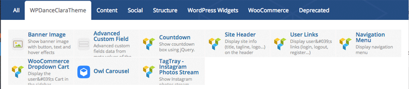

There is no configuration needed for this plugin.


## Advanced Excerpt

<div class="lead">This plugin lets control post excerpts, limit number of words showing on posts loop.</div>

Although the theme should work without any problem after activate the plugin with default configuration, we still recommend to disable excerpt filter for the_content.

From admin page, go to **Settings** > **Excerpt**, we recommend leave all options as default, except option **Filter** should untick `the_content()`:

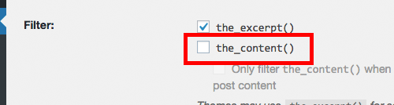

## Better Font Awesome

<div class="lead">This plugin adds a button to content editor let you insert FontAwesome icons more quickly.</div>

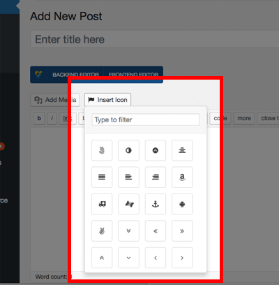

The theme should work with default configuration after activate the plugin. No extra configuration need.

## Breadcrumb NavXT

<div class="lead">This plugin adds a breadcrumb navigtion showing the visitor's path to their current location.</div>

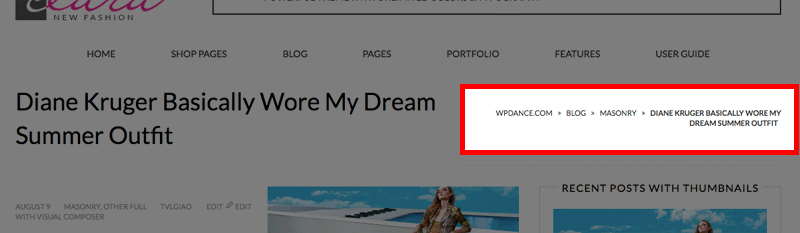

The theme should work with default configuration after activate the plugin. No extra configuration need.

## CM Registration

<div class="lead">This plugin adds AJAX-based login and registration forms with captcha, email verification. Allows to show lightbox popup for Login and Registration form when click on the links showing on site header.</div>

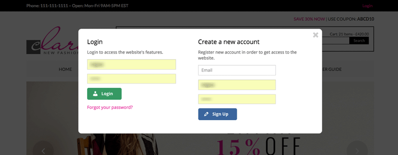

The theme should work with default configuration after activate the plugin. No extra configuration need.

## CMB2

<div class="lead">This plugin is required for the theme to show custom options for post, page and other post types.</div>

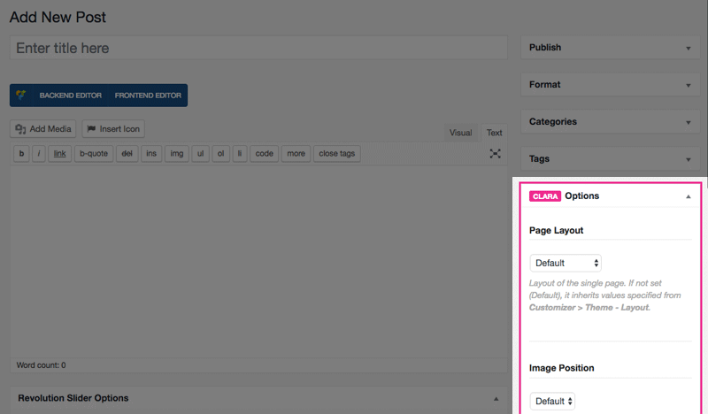


There is no configuration needed.


## CMB2 Taxonomy

<div class="lead">This plugin is required for the theme to show custom options for category, tag, taxonomy, term.</div>

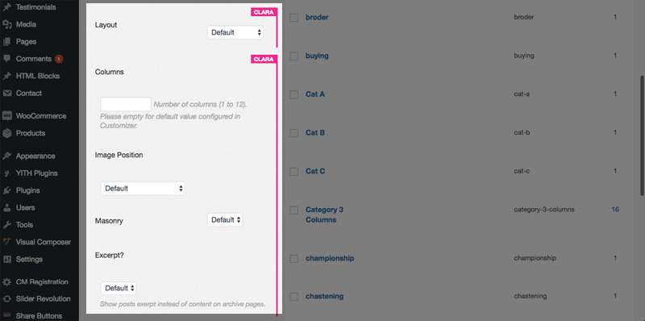

There is no configuration needed.


## Comments Widget Plus

<div class="lead">This plugin enables custom recent comments widget with extra features.</div>

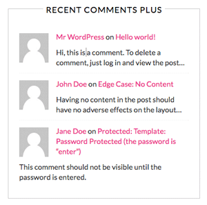

To show comments like your demo site, go to admin page, **Appearance** > **Widgets**, drag **Recent Comments Plus** widget to **Main Sidebar**.

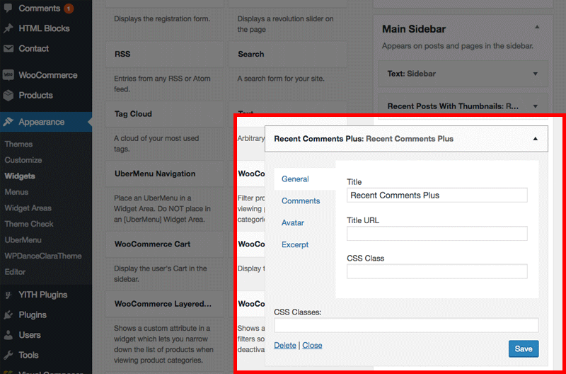

Configure like picture below:

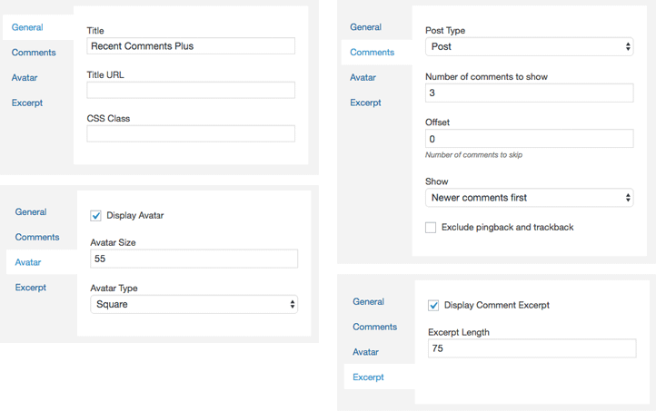

## Contact Form 7

<div class="lead">This plugin let you create contact form quickly and easily. The theme uses this plugin for showing contact form on Contact Us page.</div>

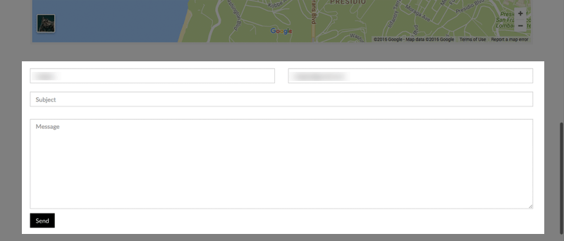

To show contact form like our demo, go to admin page, click **Contact** > **Add New**.

Copy content of file [sample-data/contact-form.txt](https://raw.githubusercontent.com/tvlgiao/wpdance-clara-docs/master/sample-data/contact-form.txt) into the **Form** field:

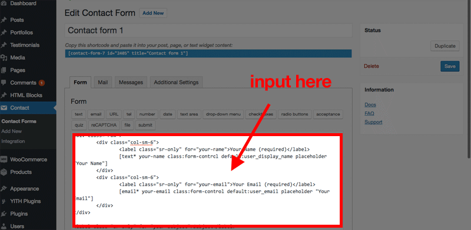

Configure your email in tab **Mail**:

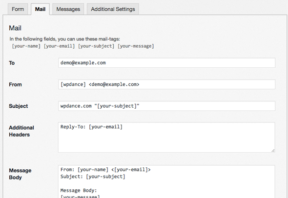

Configure messages if you want or leave it as default:

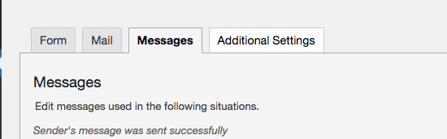

Click **Save** button to create the form. Now you can insert this shortcode to show up the contact form on any page or post you want:

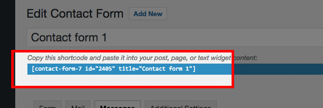

Edit page [About Us](pages.md#contact-us) you will see how the shortcode was inserted:

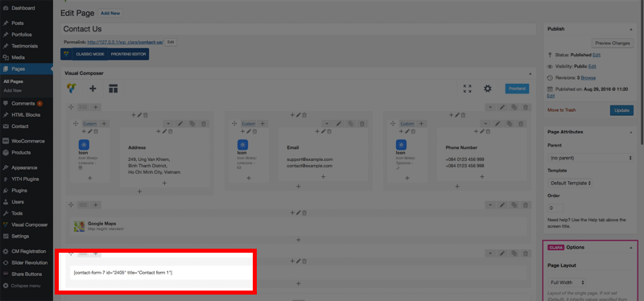


## jQuery Colorbox

<div class="lead">This plugin add javascript library jQuery Colorbox allow to show overlay images on current page. Similiar lightbox or thickbok javascript effect. Theme uses this plugin to show overlay Portfolio images.</div>

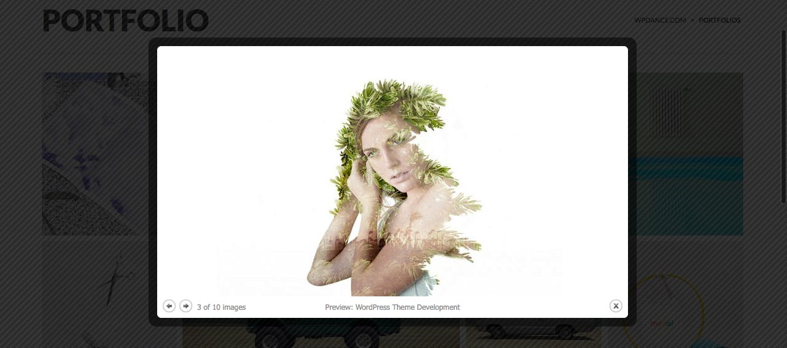

After installed and activated the plugin, go to **Settings** > **jQuery Colorbox**, tick **Disable warning** checkbox, other options should leave as default:

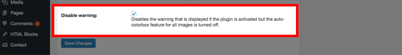

## Recent Posts Widget With Thumbnails

<div class="lead">This plugin adds a widget to show posts with thumbnails and various options. Theme uses this plugin to show recent posts with thumbnails on blog post layouts.</div>

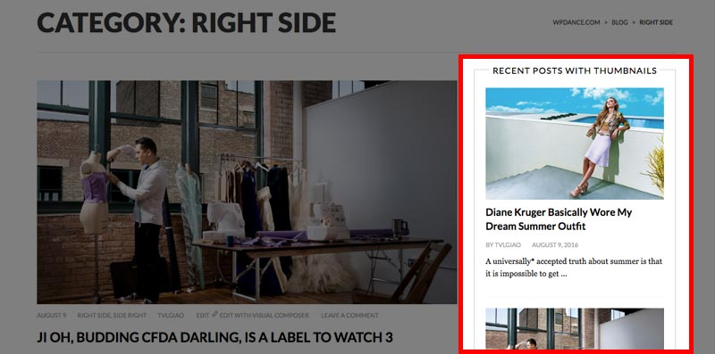

To show the widget like our demo site, go to admin page > **Appearance** > **Widgets**, drag Recent Posts With Thumbnails widget into the Main Sidebar:

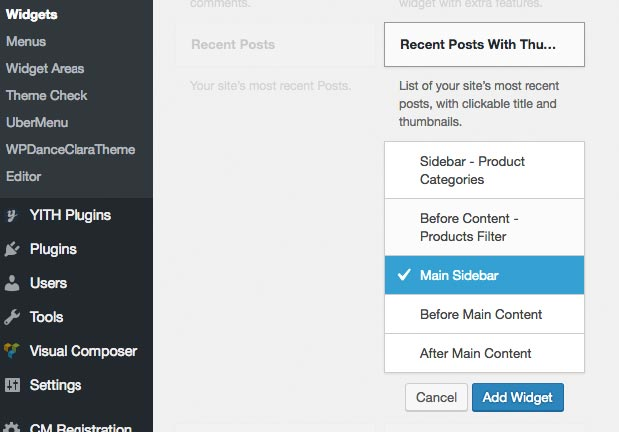

Configure the widget's parameters like below picture:

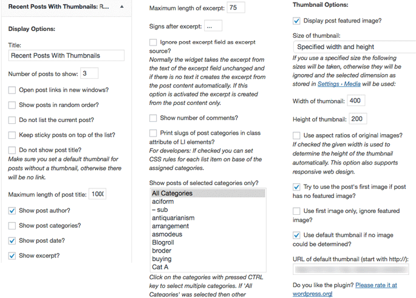


## Slider Revolution

<div class="lead">This plugin let you create unlimited image slideshows. It has powerful drag & drop slideshow builder, let you make slideshow without coding knowleadge. Theme us this plugin to show slideshow on various pages, especially on homepages.</div>

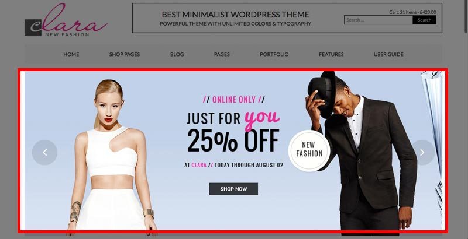

Theme included sample slideshows in zip file, just only import to zip file to quickly create the slideshows like our demo site.

- For importing slideshow instruction, please read [Import Sample Sliders](quickstart.md#import-sample-sliders) in Quick Start guide.
- For detailed how to make slideshow manually, please read the complete guide here:  [Slider Revolution WordPress 5.x Documentation](https://www.themepunch.com/revslider-doc/slider-revolution-documentation/)

## UberMenu 3

<div class="lead">This plugin let you create beautiful, flexible and reponsive mega menus. Theme includes beautiful style for this mega menu plugin, but NOT include the plugin itself.</div>

<div class="alert alert-warning">
	<ul class="fa-ul">
		<li>
			<i class="fa fa-info-circle fa-lg fa-li" aria-hidden="true"></i>
			<strong>IMPORTANT NOTE:</strong> Theme does NOT include the plugin itself. If you want to have a beautiful mega menu like our demo site, you MUST purchase the plugin at <a href="https://codecanyon.net/item/ubermenu-wordpress-mega-menu-plugin/154703?ref=tvlgiao">codecanyon.net</a> its price is <strong>$19</strong> licensing for a single website.
		</li>
	</ul>
</div>

Theme automatically adds two configurations for UberMenu once the theme is activated:

- `wpdanceclaratheme-vertical-menu`
- `wpdanceclaratheme-horizontal-menu`

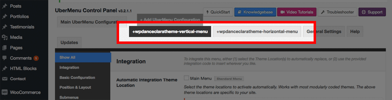

### Create UberMenu configuration manually

You can add the configuration manually by go to admin page > **Appearance** > **UberMenu**, click **+ Add UberMenu Configuration** button:

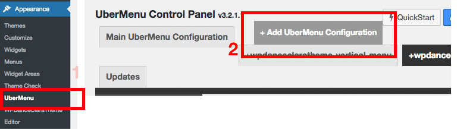

Enter the configuration name, whatever name you want:

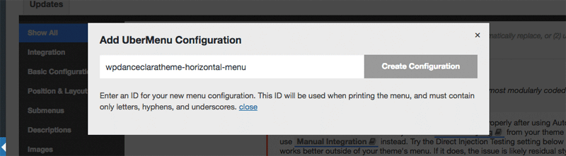

After the configuration created, click **Import/Export** tab > click **Import Settings** and copy content of file [sample-data/wpdanceclaratheme-horizontal-menu.txt](https://raw.githubusercontent.com/tvlgiao/wpdance-clara-docs/master/sample-data/wpdanceclaratheme-horizontal-menu.txt) into input box, then click button **Confirm and Import Settings Now**.

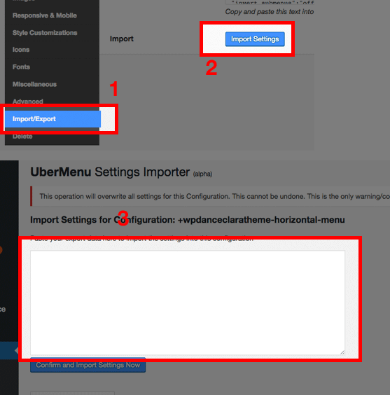

For vertical mega menu, use file [sample-data/wpdanceclaratheme-vertical-menu.txt](https://raw.githubusercontent.com/tvlgiao/wpdance-clara-docs/master/sample-data/wpdanceclaratheme-vertical-menu.txt).

### Show up mega menu on header

In UberMenu Control Panel and your configuration tab, click **Integration** tab. Scroll down to section **Manual Integration**, Select your menu in drop down box **Integrate Specific Menu** copy the shortcode syntax inside **SHORTCODE** box:

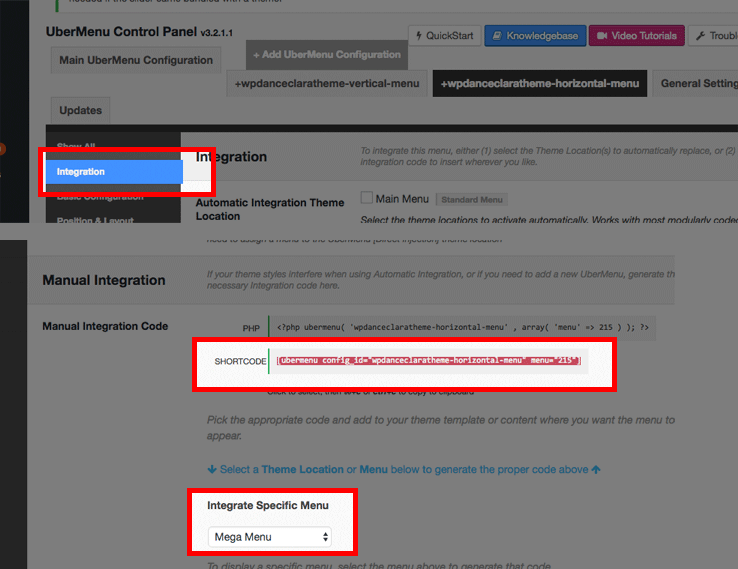

Edit any header in admin page > **HTML Blocks** > edit a header you will see the shortcode inserted in this post:

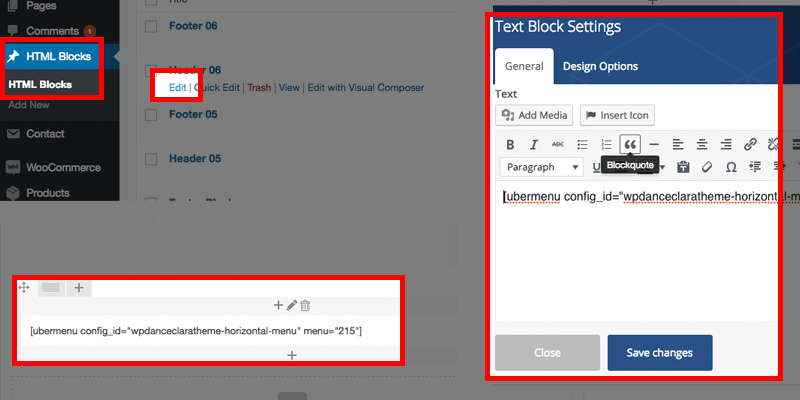

Example:

```
[ubermenu config_id="wpdanceclaratheme-horizontal-menu" menu="215"]
```

### UberMenu detailed user guide

For detailed user guide, please read from the offical website: [UberMenu Documentation](http://sevenspark.com/docs/ubermenu-3/quick-start)


## Widget CSS Classes

<div class="lead">This plugin allows to add custom CSS classes to widgets. Theme uses this plugin to make custom style for different widgets, show widgets in columns and made responsive auto show/hide widgets.</div>

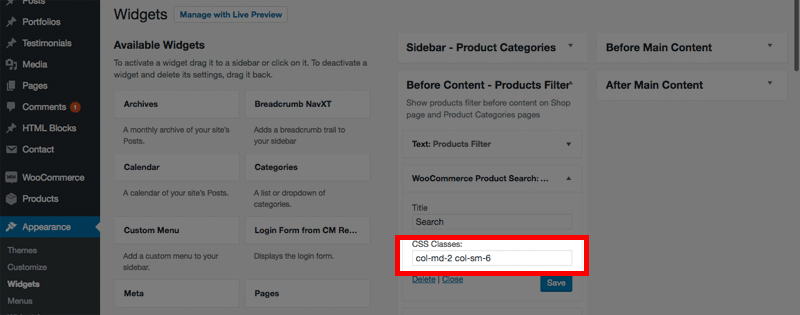

There is no configuration needed.


## WooCommerce

<div class="lead">This plugin lets you selling products online, open a full functional ecommerce website. The theme fully supports WooCommerce plugin.</div>

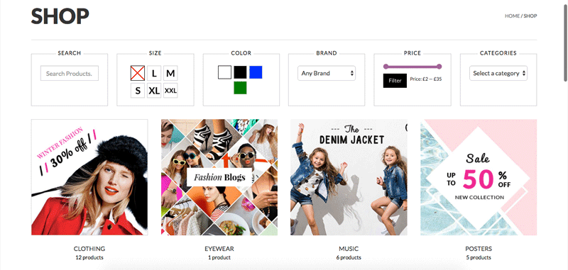

For detailed user guide please read [WooCommerce Documentation](https://docs.woocommerce.com/documentation/plugins/woocommerce/).

There is no configuration needed.


## WooCommerce Dropdown Cart

<div class="lead">This plugin provides a widget for WooCommerce to display the cart at top of page. Theme uses this plugin to show dropdown cart on the site header.</div>

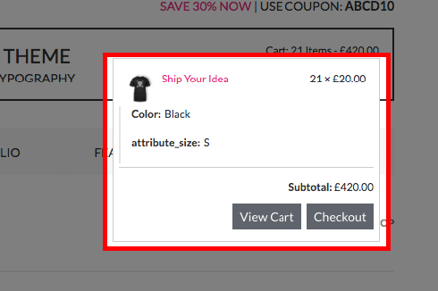

Visual Composer ShortCode for displaying dropdown cart:

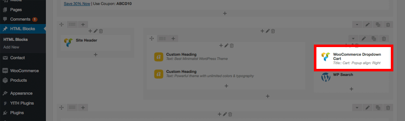

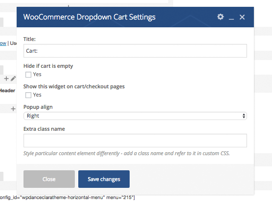

There is no configuration needed.

## WooCommerce Social Media Share Buttons

<div class="lead">The Woocommerce Social Media Share Buttons plugin allows visitors to your woocommerce shop to easily share your products on popular social media platforms. Theme use this plugin to show social sharing icons on WooCommerce product detail page and WPDance Portfolio detail page.</div>

Social icons show on product detail page:

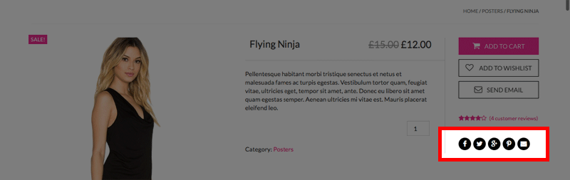

Social icons show on portfolio detail page:

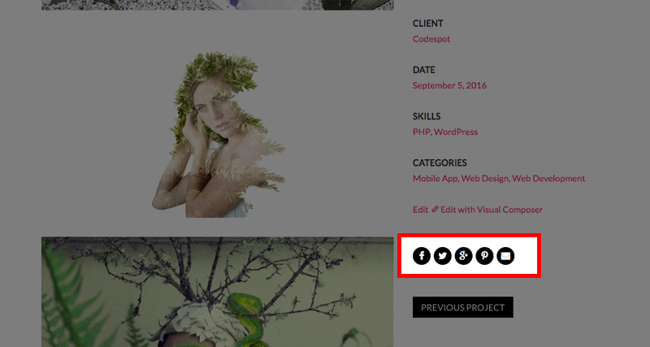

### Configure WooCommerce Social Media Sharing Buttons

After installed and activated the plugin, go to admin page > click **Sharing Buttons** on the left column:

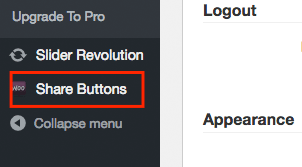

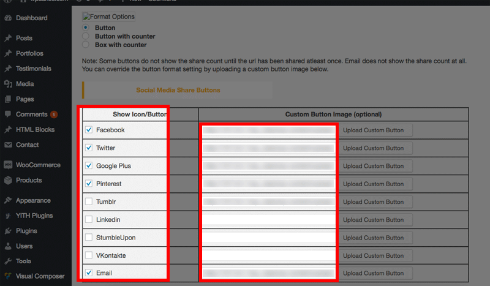

Tick any icons you want to show up. In text boxes **Custom Button Image** enter URL of the blank image:

```html
//[YOUR-SITE-URL]/wp-content/themes/wpdanceclaratheme/images/blank.png
```

For example, if your site URL is `http://www.example.com/` enter:

```html
//www.example.com/wp-content/themes/wpdanceclaratheme/images/blank.png
```

Note: don't enter the protocol `http:` for SSL secured website compatibility.

Click **Save Settings** to finish.


## WooSidebars

<div class="lead">This plugin allow to replace widget areas for specific pages, archives and other sections of WordPress. Theme uses this plugin to show different sidebars, widgets on different pages, example the sidebar on shop page will be different on blog page.</div>

Showing different sidebar on Shop page:

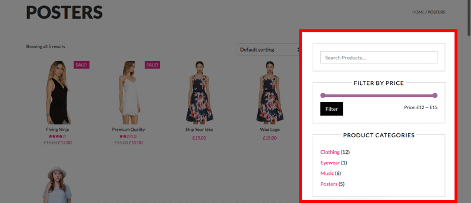

For more usage instruction, please the tutorials in [How-To](howto.md) section:

- [Make different sidebar for a specific page](howto.md#make-different-sidebar-for-a-specific-page)
- [Show horizonl product filters on shop page](howto.md#show-horizonal-product-filters-on-top-of-shop-page)

There is no additional configuration needed for this plugin.


## WPBakery Visual Composer

<div class="lead">Drag and drop page builder for WordPress. Take full control over your WordPress site, build any layout you can imagine – no programming knowledge required. Theme depends on this plugin to build Headers, Footers, and other beautiful static pages.</div>

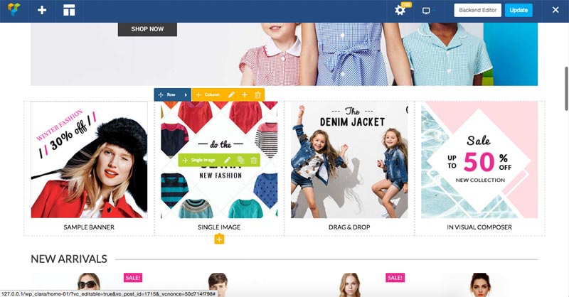

When theme is activated, it automatically adds more Visual Composer's Grid Items for displaying custom styles blog and testimonials:

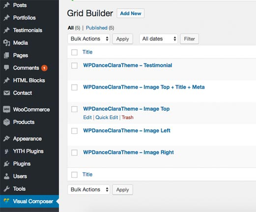

<div class="alert alert-info">
	<ul class="fa-ul">
		<li>
			<i class="fa fa-info-circle fa-lg fa-li" aria-hidden="true"></i>
			If you accidentially delete and for want to restore it, just deactivate and reactivate the theme, the grid items will be automatically added again.
		</li>
	</ul>
</div>

Theme automatically enable Visual Composer editor for Headers, Footers and Portfolio. No additional configuration needed for this plugin.

Detailed user guide can be found at the offical website: [Visual Composer User Guide](https://wpbakery.atlassian.net/wiki/display/VC/Visual+Composer+Pagebuilder+for+WordPress)


## WPDance HTMLBlock

<div class="lead">This plugin is required to enable Headers & Footers drag & drop editor.</div>

Theme automatically add custom Headers & Footers to this plugin when the theme is activated. No additional configuration needed.

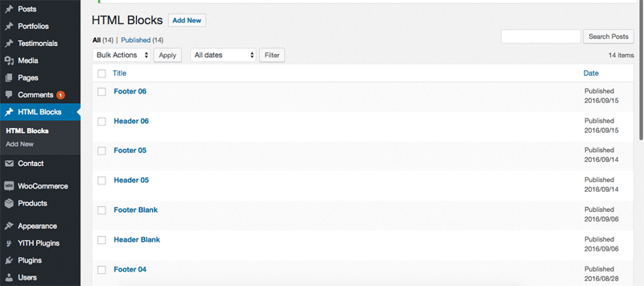

<div class="alert alert-info">
	<ul class="fa-ul">
		<li>
			<i class="fa fa-info-circle fa-lg fa-li" aria-hidden="true"></i>
			If you accidentially delete or want to restore the original version, just delete it, then deactivate and reactivate the theme again, it will be restored automatically.
		</li>
	</ul>
</div>

For more detail how to use this plugin for managing Headers & Footers, please read instruction in [Headers & Footers](htmlblocks.md) section.


## WPDance Portfolio

<div class="lead">This plugin adds portfolio post type, portfolio shortcode and Visual Composer shortcode. Lets you create a simple and beautiful portfolio page.</div>

After installed and activated, a new menu **Portfolios** will appear on the admin menu:

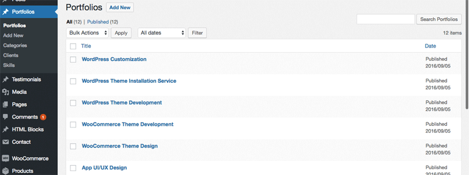

You can use **WordPress Importer** plugin to import sample portfolio items like our demo site. Please read instruction [how to import sample data](quickstart.md#import-sample-data) in Quick Start section.


## WPDance Testimonial

<div class="lead">This plugin adds Testimonial post type, Visual composer testimonial shortcode.</div>

After installed and activated, a new menu **Testimonials** will appear on the admin menu:

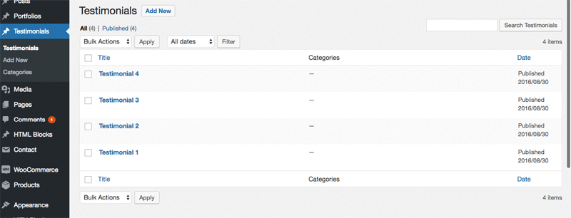

You can use **WordPress Importer** plugin to import sample testimonial items like our demo site. Please read instruction [how to import sample data](quickstart.md#import-sample-data) in Quick Start section.

For showing testimonials on pages, please read instruction [How to show testimonials on a page](howto.md#show-testimonials-on-a-page) in How-To section.


## YITH WooCommerce Quick View

<div class="lead">This plugin enables product quick-view on the current page for WooCommerce.</div>

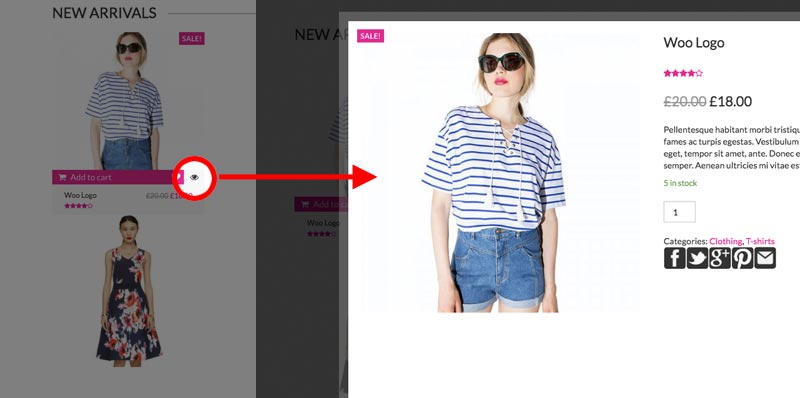

After installed and activated the plugin, leave all plugin settings as default. There is no need additional configuration for this plugin.

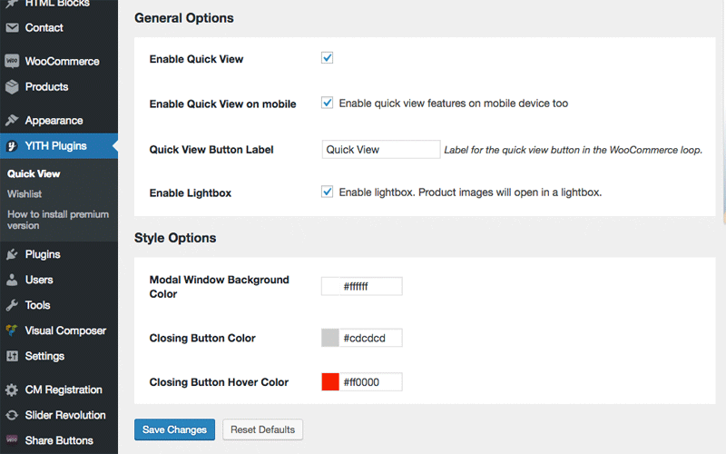


## YITH WooCommerce Wishlist

<div class="lead">This plugin enable wishlist features for WooCommerce. Allows you to add Wishlist functionality to your e-commerce store.</div>

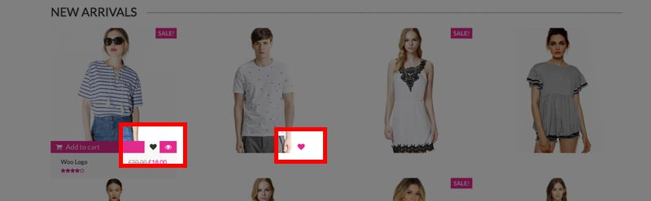

After installed and activated the plugin, leave all plugin settings as default. There is no need additional configuration for this plugin.

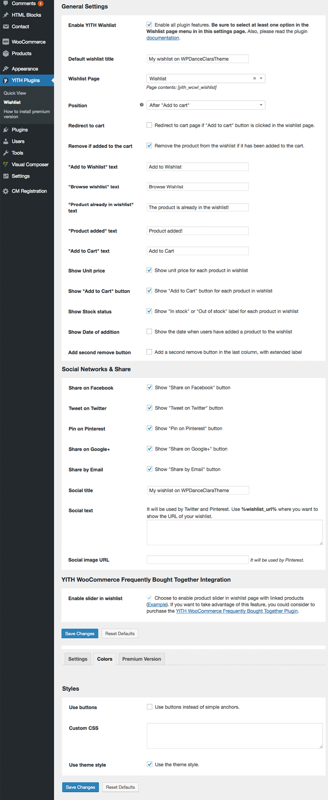

