# Quick Start

	<ul class="fa-ul">
		<li>
			<i class="fa fa-lightbulb-o fa-2x fa-li" aria-hidden="true"></i>
			<strong>Note:</strong> You can skip this page, just follow instructions from the Theme Walkthrough to complete all steps.
		</li>
	</ul>

## Theme Walkthrough Page

Theme provide step by step walkthrough guide to help you quickly learning:

- Activate recommended plugins.
- New features of the theme.
- Theme options.
- Import sample data to look like the demo site.

Now click the button **Theme Quickstart** which appears after the theme is activated (alternatively, **Appearance** > **WPDanceClaraTheme**):

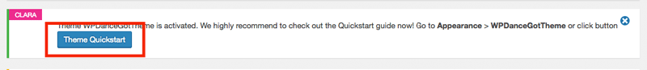

Next, click button **Let's get started now** and follow the rest instruction showing on your page:

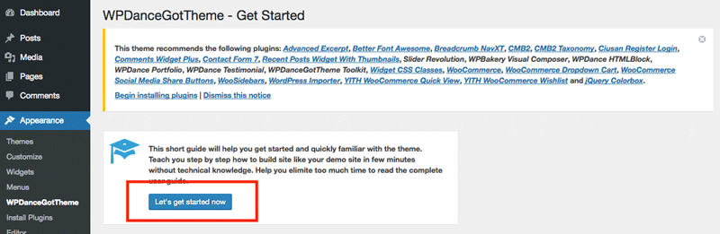

## Install Plugins

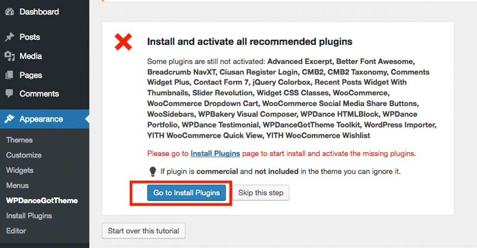

We recommend **install** and **activate** all plugins for quick start. Laterly, you can deactivate any unnecessary plugin to improve site performance:

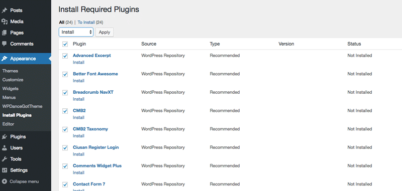

	<ul class="fa-ul">
		<li>
			<i class="fa fa-info-circle fa-lg fa-li" aria-hidden="true"></i>
			Install & activate plugins may take a while.  Please patience. Also, we recommend <strong>activate each plugin step by step</strong>.
		</li>
	</ul>

After all plugins are installed and activated, return the theme walkthrough page:
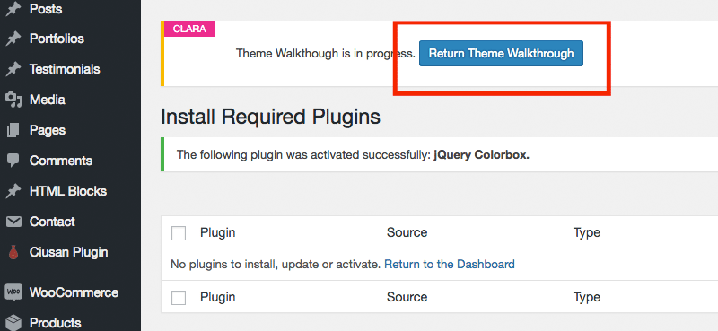

## Import Sample Sliders

Follow the instruction to import sample sliders:

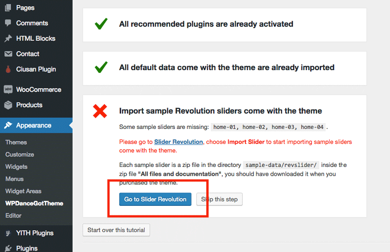

Click **Import Slider** to start importing sample sliders:

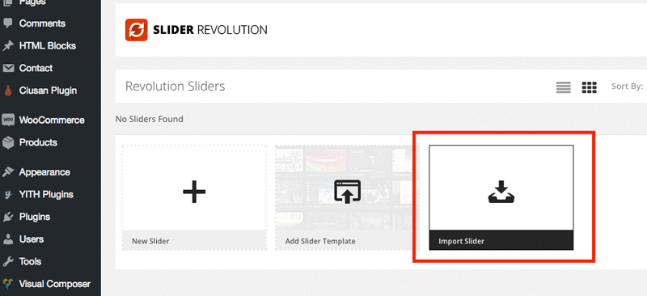

Please find the zip files contain sample sliders in the full package download from ThemeForest Download page:

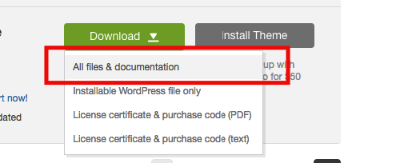

Unzip the file and open directory **sample-data/**, import all slider **home-01**, **home-02**, **home-03**, **home-04**...

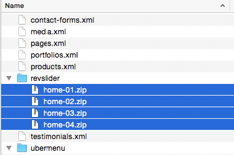

## Import Sample Data

Go back to the theme walkthrough page, a new instruction will appear to guide you import sample data to look like our demo site.

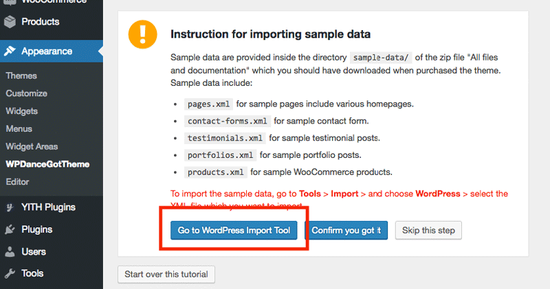

Click **Run Importer**

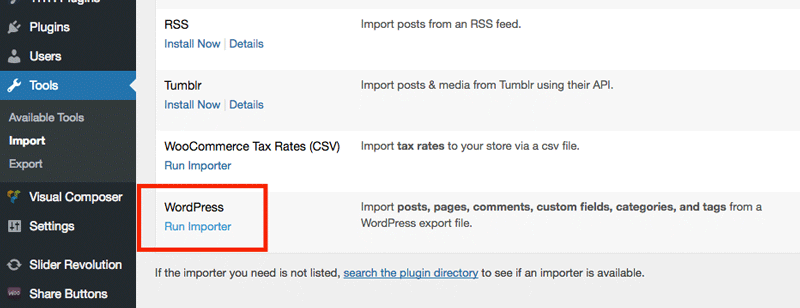

Choose sample data file provided in the **full package file** to start importing:

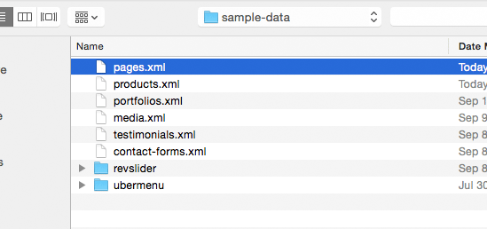

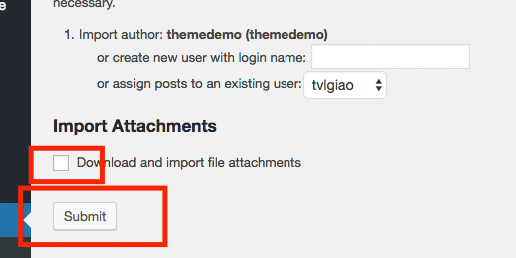

	<ul class="fa-ul">
		<li>
			<i class="fa fa-info-circle fa-lg fa-li" aria-hidden="true"></i>
			Note: Don't choose **Download and import file attachments
		</li>
	</ul>

Repeat importing all other sample data files.

After imported all sample data, go back the theme walkthrough page. Click button **Confirm you got it** to finish this step:

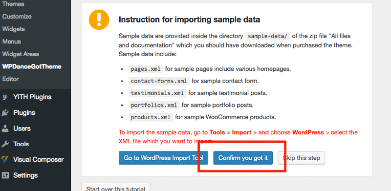

## Choose Default Header & Footer

The new instruction will appear to show you how to configure default Header & Footer for your site. Let follow the instruction, click button **Go to Customizer**:

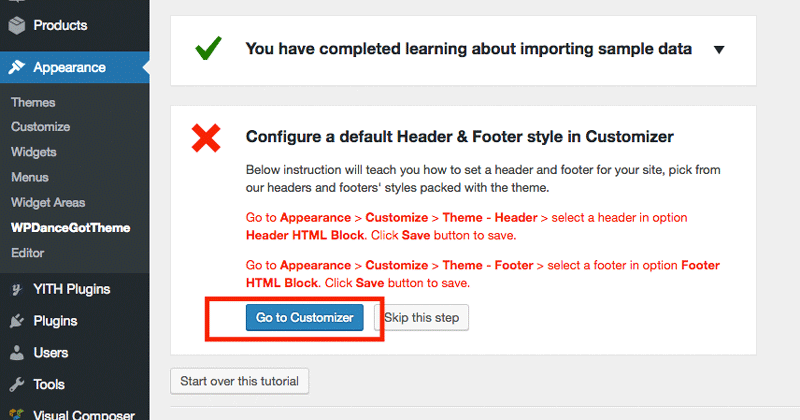

Choose a header and footer you want to set as default and click **Save & Publish** button:

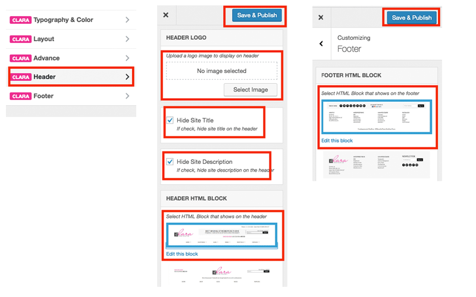

Back to the theme walkthrough page.

## Choose a Homepage

Follow the next instruction to specify a homepage. Click **Go to Customizer** button:

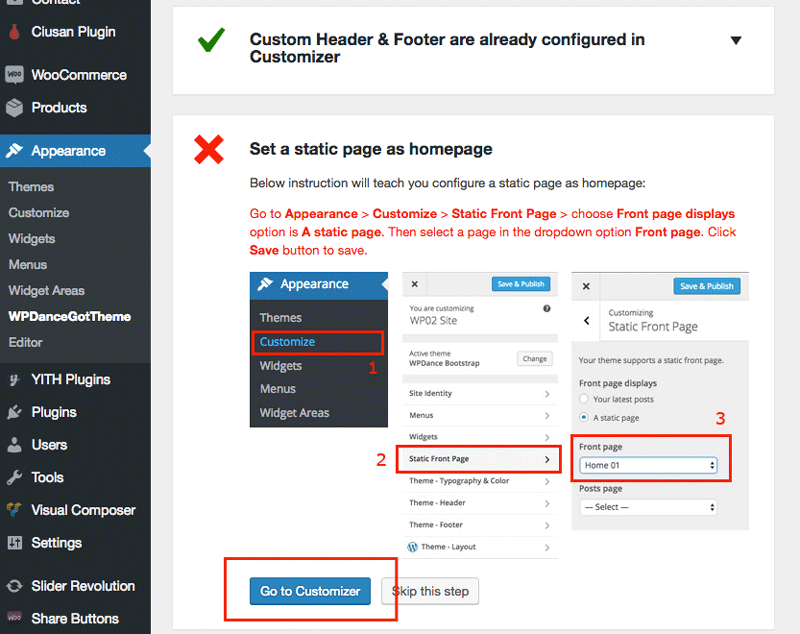

Configure as showing below, then click **Save & Publish** button:

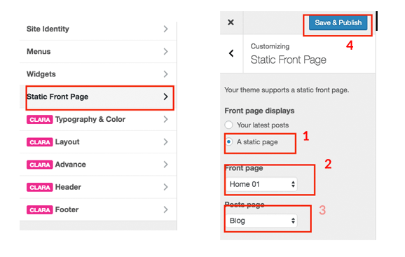

Back to the theme walkthrough page.

## Introduce Theme Customizer

New instruction appears to introduce about Theme Customzer, check it out and click button **Confirm you got it** to finish:

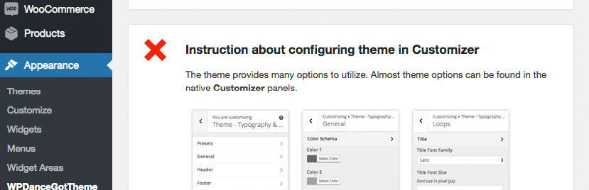

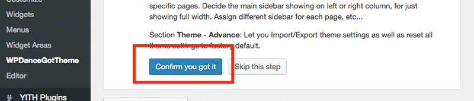

# Introduce Theme Extra Options

New instruction appears to introduce about theme options available for specific pages, posts, post types, categories, taxonomies...

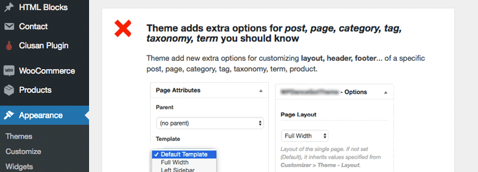

Check it out and click **Confirm you got it** button to finish this step:

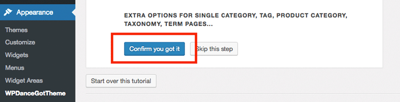

Congrats! You have just completed the quick start guide.

# View Your Website

Now let's visit your website front page, before starting customization.

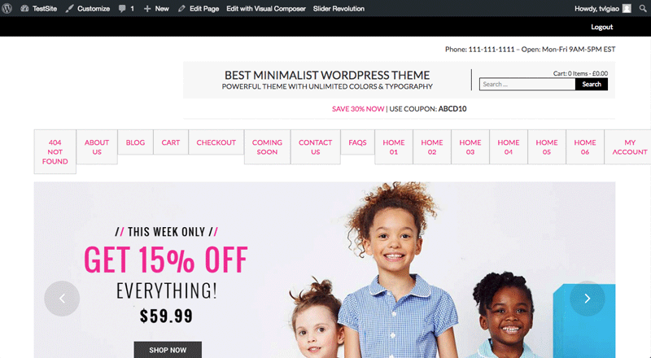